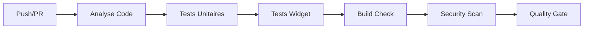

# 🚀 Stratégie CI/CD - Manounou

**Version** : 1.0.0  
**Date** : 2025-01-28  
**Projet** : Manounou - Application Familiale iOS & Android

---

## 📋 Table des Matières

1. [Vue d'ensemble](#vue-densemble)
2. [Stratégie de Branches](#stratégie-de-branches)
3. [Environnements](#environnements)
4. [Pipeline CI/CD](#pipeline-cicd)
5. [Stratégie de Tests](#stratégie-de-tests)
6. [Stratégie de Déploiement](#stratégie-de-déploiement)
7. [Versioning & Releases](#versioning--releases)
8. [Sécurité & Qualité](#sécurité--qualité)
9. [Monitoring & Alertes](#monitoring--alertes)
10. [Rollback & Recovery](#rollback--recovery)

---

## 🎯 Vue d'ensemble

### Objectifs

1. **Qualité** : Garantir la qualité du code avant chaque déploiement
2. **Rapidité** : Réduire le temps de feedback (< 10 min pour CI)
3. **Fiabilité** : Automatiser les déploiements avec validation
4. **Sécurité** : Protéger les données familiales sensibles
5. **Traçabilité** : Tracer chaque déploiement et changement

### Principes

- ✅ **Fail Fast** : Détecter les erreurs le plus tôt possible
- ✅ **Automation First** : Automatiser tout ce qui peut l'être
- ✅ **Security by Design** : Sécurité intégrée à chaque étape
- ✅ **Documentation** : Documenter chaque décision et processus
- ✅ **Monitoring** : Surveiller en continu la santé de l'application

---

## 🌿 Stratégie de Branches

### Modèle : **GitHub Flow** (Simplifié)

```
main (production)
  ↑
develop (staging)
  ↑
feature/* (développement)
  ↑
hotfix/* (corrections urgentes)
```

### Branches

| Branche | Rôle | Protection | Déploiement |
|:--------|:----|:-----------|:------------|
| `main` | Production | ✅ Requiert PR + reviews | Production (App Store, Play Store) |
| `develop` | Staging | ✅ Requiert PR | Staging (TestFlight, Internal Testing) |
| `feature/*` | Développement | ❌ Aucune | Aucun (tests locaux) |
| `hotfix/*` | Corrections urgentes | ✅ Requiert PR + reviews | Production directe |

### Règles de Branches

1. **`main`** :
   - Toujours stable et déployable
   - Merge uniquement via PR avec 1+ approbation
   - Tests CI obligatoires (100% pass)
   - Création automatique de release sur tag `v*.*.*`

2. **`develop`** :
   - Intégration des features
   - Merge via PR (auto-merge si CI passe)
   - Déploiement automatique en staging

3. **`feature/*`** :
   - Développement de nouvelles fonctionnalités
   - Nommage : `feature/nom-fonctionnalite`
   - CI sur push (analyse + tests)

4. **`hotfix/*`** :
   - Corrections critiques en production
   - Nommage : `hotfix/nom-correction`
   - Merge direct vers `main` après validation

---

## 🌍 Environnements

### Environnements de Déploiement

| Environnement | Branche | Supabase | Déploiement | Accès |
|:-------------|:--------|:---------|:------------|:------|
| **Development** | `feature/*` | Local/Dev | Aucun | Développeurs |
| **Staging** | `develop` | Staging Project | TestFlight, Internal Testing | QA, Beta Testers |
| **Production** | `main` | Production Project | App Store, Play Store | Utilisateurs finaux |

### Configuration Supabase

```bash
# Development
SUPABASE_URL_DEV=https://dev-xxxxx.supabase.co
SUPABASE_ANON_KEY_DEV=eyJhbGciOiJIUzI1NiIsInR5cCI6IkpXVCJ9...

# Staging
SUPABASE_URL_STAGING=https://staging-xxxxx.supabase.co
SUPABASE_ANON_KEY_STAGING=eyJhbGciOiJIUzI1NiIsInR5cCI6IkpXVCJ9...

# Production
SUPABASE_URL=https://xxxxx.supabase.co
SUPABASE_ANON_KEY=eyJhbGciOiJIUzI1NiIsInR5cCI6IkpXVCJ9...
```

---

## 🔄 Pipeline CI/CD

### Phase 1 : CI (Continuous Integration)

**Déclencheurs** :
- Push sur n'importe quelle branche
- Pull Request vers `main` ou `develop`

**Étapes** :



1. **Analyse Statique** (`flutter analyze`)
   - Durée : ~2 min
   - Échec si : Erreurs critiques
   - Warning si : Avertissements (non bloquant)

2. **Tests Unitaires** (`flutter test`)
   - Durée : ~3-5 min
   - Couverture minimum : 60%
   - Échec si : Tests échouent

3. **Build Check** (iOS, Android, Web)
   - Durée : ~5-8 min
   - Vérification compilation
   - Échec si : Build échoue

4. **Security Scan** (Dépendances)
   - Durée : ~1-2 min
   - Scan des vulnérabilités
   - Échec si : Vulnérabilités critiques

5. **Quality Gate**
   - Validation finale
   - Merge autorisé si tous les checks passent

### Phase 2 : CD (Continuous Deployment)

#### CD Staging (`develop` → Staging)

**Déclencheurs** :
- Merge vers `develop`
- Push direct sur `develop` (développeurs autorisés)

**Étapes** :

1. **Build Staging**
   - Configuration : `staging`
   - Variables : `SUPABASE_URL_STAGING`, `SUPABASE_ANON_KEY_STAGING`
   - Durée : ~10-15 min

2. **Tests E2E** (optionnel)
   - Tests d'intégration
   - Durée : ~5-10 min

3. **Déploiement Staging**
   - **iOS** : Upload vers TestFlight (Internal Testing)
   - **Android** : Upload vers Play Console (Internal Testing)
   - **Web** : Déploiement sur Vercel/Netlify (staging)

4. **Notification**
   - Slack/Email aux testeurs
   - Création d'une issue de test

#### CD Production (`main` → Production)

**Déclencheurs** :
- Tag `v*.*.*` sur `main`
- Workflow manuel (avec confirmation)

**Étapes** :

1. **Validation Release**
   - Vérification du tag
   - Vérification des changelogs
   - Confirmation manuelle (si workflow manuel)

2. **Build Production**
   - Configuration : `production`
   - Variables : `SUPABASE_URL`, `SUPABASE_ANON_KEY`
   - Durée : ~15-20 min

3. **Tests de Régression** (optionnel)
   - Tests critiques
   - Durée : ~5 min

4. **Déploiement Production**
   - **iOS** : Upload vers App Store Connect (soumission manuelle)
   - **Android** : Upload vers Play Console (soumission manuelle)
   - **Web** : Déploiement sur Vercel/Netlify (production)

5. **Release GitHub**
   - Création automatique de release
   - Notes de version générées
   - Artifacts attachés

6. **Notification**
   - Slack/Email aux stakeholders
   - Mise à jour du changelog

---

## 🧪 Stratégie de Tests

### Pyramide de Tests

```
        /\
       /  \  E2E Tests (5%)
      /____\
     /      \  Integration Tests (15%)
    /________\
   /          \  Unit Tests (80%)
  /____________\
```

### Types de Tests

| Type | Outil | Couverture | Durée | Fréquence |
|:-----|:------|:-----------|:------|:----------|
| **Unit Tests** | `flutter test` | 80% | ~3-5 min | À chaque push |
| **Widget Tests** | `flutter test` | 60% | ~2-3 min | À chaque push |
| **Integration Tests** | `integration_test` | 15% | ~5-10 min | Avant merge `develop` |
| **E2E Tests** | `flutter_driver` | 5% | ~10-15 min | Avant release |

### Critères de Qualité

- ✅ **Couverture minimale** : 60% (unit + widget)
- ✅ **Tous les tests passent** : Obligatoire
- ✅ **Aucune régression** : Comparaison avec baseline
- ✅ **Performance** : Temps de build < 20 min

---

## 🚀 Stratégie de Déploiement

### Déploiement iOS

#### Staging (TestFlight)
- **Fréquence** : À chaque merge sur `develop`
- **Distribution** : Internal Testing
- **Validation** : Tests manuels par QA
- **Durée** : ~15 min (build) + ~5 min (upload)

#### Production (App Store)
- **Fréquence** : Sur tag `v*.*.*`
- **Distribution** : App Store Connect
- **Soumission** : Manuelle (après validation)
- **Durée** : ~20 min (build) + ~10 min (upload)

### Déploiement Android

#### Staging (Internal Testing)
- **Fréquence** : À chaque merge sur `develop`
- **Distribution** : Play Console Internal Testing
- **Validation** : Tests manuels par QA
- **Durée** : ~10 min (build) + ~3 min (upload)

#### Production (Play Store)
- **Fréquence** : Sur tag `v*.*.*`
- **Distribution** : Play Console Production
- **Soumission** : Manuelle (après validation)
- **Durée** : ~15 min (build) + ~5 min (upload)

### Déploiement Web (Optionnel)

- **Staging** : Vercel Preview (chaque PR)
- **Production** : Vercel Production (sur `main`)

---

## 📦 Versioning & Releases

### Versioning (Semantic Versioning)

Format : `MAJOR.MINOR.PATCH+BUILD`

- **MAJOR** : Changements incompatibles (ex: 2.0.0)
- **MINOR** : Nouvelles fonctionnalités compatibles (ex: 1.1.0)
- **PATCH** : Corrections de bugs (ex: 1.0.1)
- **BUILD** : Numéro de build incrémental (ex: +1, +2)

### Processus de Release

1. **Préparation**
   ```bash
   # Mise à jour de la version
   ./ops/version-bump.sh minor  # ou patch, major
   
   # Commit
   git add flutterflow_export/pubspec.yaml
   git commit -m "chore: bump version to 1.1.0"
   git push origin develop
   ```

2. **Merge vers main**
   ```bash
   # Créer une PR develop → main
   gh pr create --base main --head develop --title "Release v1.1.0"
   
   # Après approbation et merge
   git checkout main
   git pull origin main
   ```

3. **Création du tag**
   ```bash
   git tag v1.1.0
   git push origin main --tags
   ```

4. **Déclenchement automatique**
   - Les workflows CD se déclenchent automatiquement
   - Build et upload vers les stores
   - Création de la release GitHub

5. **Soumission manuelle**
   - Validation des builds
   - Soumission vers App Store / Play Store
   - Publication après validation

### Release Notes

Format automatique :

```markdown
## 🚀 Manounou v1.1.0

**Build:** 1  
**Date:** 2025-01-28

### ✨ Nouvelles Fonctionnalités
- Feature 1
- Feature 2

### 🐛 Corrections
- Bug fix 1
- Bug fix 2

### 🔧 Améliorations
- Improvement 1
```

---

## 🔐 Sécurité & Qualité

### Security Scanning

1. **Dépendances** : `dart pub outdated` + `safety check`
2. **Secrets** : Détection de secrets dans le code
3. **Vulnérabilités** : Scan automatique des dépendances

### Quality Gates

| Check | Critère | Action si Échec |
|:------|:--------|:----------------|
| **Analyse** | 0 erreurs critiques | Bloque le merge |
| **Tests** | 100% pass | Bloque le merge |
| **Couverture** | ≥ 60% | Avertissement (non bloquant) |
| **Security** | 0 vulnérabilités critiques | Bloque le merge |
| **Build** | Build réussi | Bloque le merge |

---

## 📊 Monitoring & Alertes

### Métriques à Surveiller

1. **CI/CD**
   - Durée des pipelines
   - Taux de succès des builds
   - Temps de feedback

2. **Application**
   - Crash rate
   - Performance (temps de chargement)
   - Erreurs Supabase

3. **Déploiements**
   - Fréquence des releases
   - Temps de déploiement
   - Taux de rollback

### Alertes

- ❌ **Critique** : Build échoue en production
- ⚠️ **Warning** : Build échoue en staging
- ℹ️ **Info** : Nouvelle release créée

### Canaux de Notification

- **Slack** : Channel `#manounou-releases`
- **Email** : Équipe de développement
- **GitHub** : Issues et PRs

---

## 🔄 Rollback & Recovery

### Stratégie de Rollback

1. **Détection** : Monitoring automatique des erreurs
2. **Décision** : Validation manuelle (si critique)
3. **Action** : Rollback vers version précédente
4. **Communication** : Notification aux utilisateurs

### Processus de Rollback

```bash
# 1. Identifier la version précédente
git tag -l "v*.*.*" | tail -2

# 2. Créer un hotfix
git checkout -b hotfix/rollback-v1.1.0 main
git revert <commit-hash>

# 3. Merge et tag
git checkout main
git merge hotfix/rollback-v1.1.0
git tag v1.1.1
git push origin main --tags

# 4. Déploiement automatique
```

---

## 📚 Documentation & Ressources

### Scripts Utilitaires

- `ops/verify-cicd.sh` : Vérification de la configuration
- `ops/version-bump.sh` : Mise à jour de version
- `ops/pre-commit.sh` : Validation avant commit

### Documentation

- [Guide CI/CD Setup](./CI_CD_SETUP.md)
- [Rapport de Statut CI/CD](./CICD_STATUS_REPORT.md)
- [Quick Start CI/CD](./CICD_QUICK_START.md)

---

## ✅ Checklist de Mise en Place

- [x] Workflows GitHub Actions créés
- [x] Secrets configurés
- [x] Stratégie de branches définie
- [ ] Environnements Supabase configurés (staging + production)
- [ ] Tests E2E configurés
- [ ] Monitoring configuré
- [ ] Notifications configurées
- [ ] Documentation à jour

---

**🎯 Prochaine étape** : Optimiser les workflows existants avec cache et parallélisation

